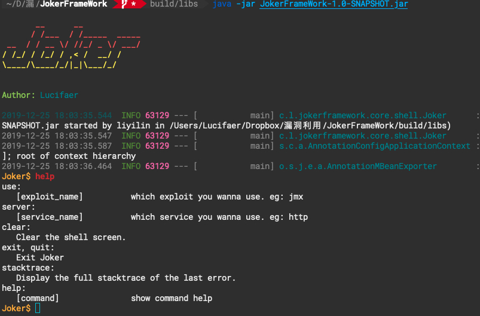
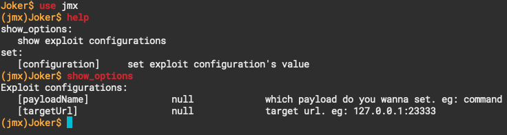
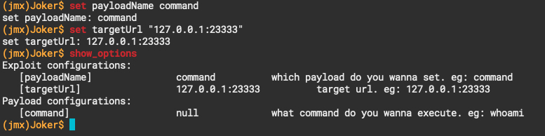
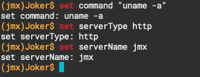
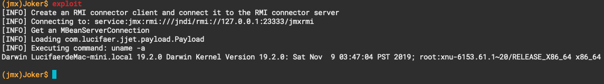
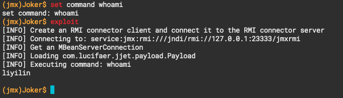

# JokerFrameWork

## 0x00 简介

一个Java写的攻击框架，主要负责解决每次分析完漏洞后poc散乱放置的问题，同时也为了更方便的在分析过程中搭建各种服务，如开启`rmi server`这样的重复性劳动。

## 0x01 依赖

本项目主要由以下组件构成：
* SpringBoot：`1.5.8`(SpringShell自带的SpringBoot版本)
* SpringShell：`2.0.0.RELEASE`

## 0x02 使用

### 2.1 从源码编译

在项目根目录直接运行：

```
./gradlew build
```

如果遇到测试不通过的情况可以执行以下命令跳过测试：

```
./gradlew build -x test
```

编译生成的jar包在`./build/libs/`

### 2.2 默认server配置文件

```
cp -r ./server ./build/libs/
```

这样是为了保证Joker可以找到相关的配置。

### 2.3 运行

```
java -jar ./build/libs/JokerFrameWork-1.0-SNAPSHOT.jar
```

就可以看到如下界面：



由于目前还有一些bug，所以`help`命令显示的并不完全，后续将重构展示界面这一部分的内容。

## 0x03 测试例子

### 3.1 开启测试环境

在`./server/http/jmx/`中内置了测试环境`jmx-server.jar`可以方便的用于演示。

命令行运行：

```
java -jar -Dcom.sun.management.jmxremote.port=23333 -Dcom.sun.management.jmxremote.authenticate=false -Dcom.sun.management.jmxremote.ssl=false -Djava.rmi.server.hostname=127.0.0.1 jmx-server.jar
```

会在本地`23333`端口开启一个`jmx`服务，该服务是没有设置用户登录的。

### 3.2 攻击测试

目前只是内置了一个攻击`jmx`未授权服务的exp，将用这个例子来演示如何使用。

`use`命令用于使用相关的`epxloit`，在使用`use`后可以使用help来查看可使用的命令：



使用`set`命令设置值：



设置其他自定义参数：



`exploit`命令开始攻击：



