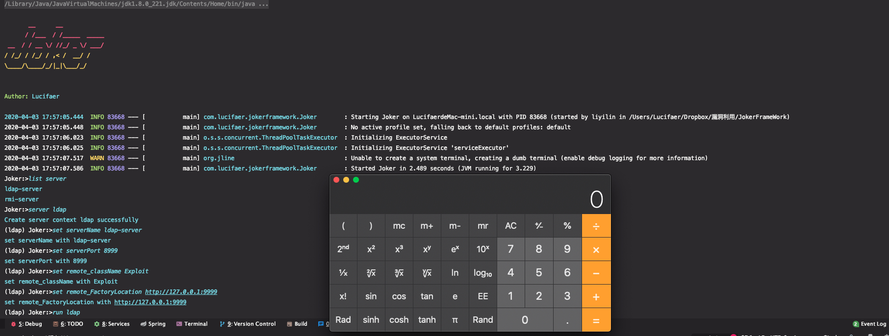
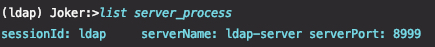

# JokerFrameWork

## 0x00 简介

一个Java写的攻击框架，主要负责解决每次分析完漏洞后poc散乱放置的问题，同时也为了更方便的在分析过程中搭建各种服务，如开启`rmi server`这样的重复性劳动。

## 0x01 依赖

本项目主要由以下组件构成：
* SpringBoot：`1.5.8`(SpringShell自带的SpringBoot版本)
* SpringShell：`2.0.0.RELEASE`

## 0x02 使用

### 2.1 从源码编译

在项目根目录直接运行：

```
./gradlew build
```

如果遇到测试不通过的情况可以执行以下命令跳过测试：

```
./gradlew build -x test
```

编译生成的jar包在`./build/libs/`

### 2.2 server使用案例

1. 查看可创建服务

    ```shell script
     list server
    ```
2. 查看已经存在的服务

    ```
     list server_process
    ```

3. 创建server session（也就是一个shellContext）用于接收存储参数

    ```
     server ldap
    ```
  
4. 选择想要创建的服务

    ```
     set serverName ldap-server
    ```
   
5. 设置服务开启的url和端口信息：

    ldap默认`0.0.0.0:1389`
    rmi默认`0.0.0.0:2000`

    ```
     set serverPort 8999
    ```

6. 设置必须参数：

    ldap需要设置`remote_className`， `remote_FactoryLocation`
    
    rmi需要设置`remote_className`，`remote_FactoryName`，`remote_FactoryLocation`
    
    主要用于指定远程类名及地址。
    
    ```
     set remote_className Exploit
     set remote_FactoryLocation http://127.0.0.1:9999
    ```

7. 开启服务：

    ```
     run ldap
    ```   

8. 最后开启远程服务绑定自己的恶意类即可

最终效果：



查看端口占用情况：



## 3. next

1. 后续会进行文档编写，目前只是demo版本
2. 调整框架结构，支持插件式热插拔